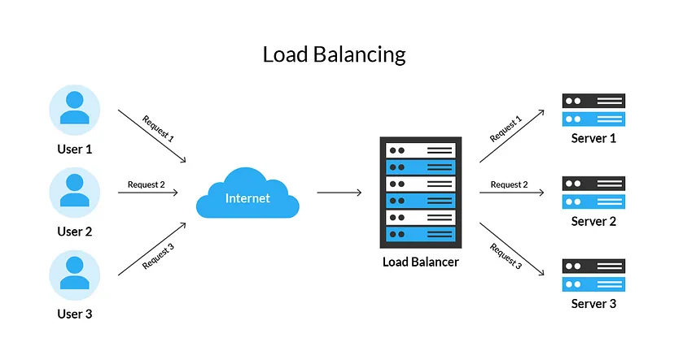

<p align="left"> 
  
</p>

<!-- [](https://rishavchanda.io) -->
<!--  -->

<!-- <p align="center"> 
  
</p>

<h3 align="center" style="text-decoration:none"> < Hello World , I'm Sagar /> </h3>

<div align="center">

  [](https://git.io/typing-svg)

</div> -->

<!-- --- -->

<div>
  

  <h3 align="center" style="text-decoration:none"> < Hello World , I'm Sagar /> </h3>

  <div align="center">

[](https://git.io/typing-svg)

  </div>
</div>


<!-- Old About Me -->
<!-- <div align="left">

  ```csharp
    About Me
    ------------------------------------------
    * 🔭 I’m currently working on > Spring Boot Microservices

    * 🌱 I’m currently learning > DevOps

    * 💬 Ask me about > Java , Spring Boot

    * 📫 How to reach me > sagarsingh0802@gmail.com

    * ⚡ Fun fact > I am Funny
  ```

</div> -->


<div>  
  <h2></h2>

- 🔭 I’m currently working on **Spring Boot Microservices**

- 🌱 I’m currently learning **DevOps**

- 💬 Ask me about **Java , Spring Boot**

- ⚡ Fun fact **I am Funny**

- 🕵️‍♂️ Know more about me on **www.oceanbytes.in**

- 📄 Want my resume **Download Here ⬇**

[//]: # (  - 📄 Want my resume **Download Here [⬇]&#40;resume/Sagar_Resume.pdf&#41;**)

  <h2></h2>
</div>


<!-- ═════════════════ ⋆★⋆ ═════════════════ -->

<!-- Socials-Section:START -->
<h3 align="right">Connect with
me
</h3>

<p align="right">
  <!--   <a href="https://twitter.com/" target="blank">
    </a> -->
  <a href="https://www.linkedin.com/in/sagarbhadouria" target="blank">
  </a>
  <a href="mailto:sagarsingh0802@gmail.com" target="blank">
  </a>
  <a href="https://www.oceanbytes.in/" target="blank">
  </a>
  <a href="https://instagram.com/sagar_jersey10" target="blank">
  </a>
  <a href="https://www.youtube.com/c/jersey10" target="blank">
  </a>
</p>
<!-- Socials-Section:END -->

</br>


<!--Old Skill Section -->
<!-- <h3 align="center"> ⋆ Languages ⋆ </h3>
<p align="center">
  <a href="https://www.java.com/" target="_blank" rel="noreferrer"> 
  </a>
  <a href="https://www.cprogramming.com/" target="_blank" rel="noreferrer"> 
  </a>
  <a href="https://www.w3.org/html/" target="_blank" rel="noreferrer"> 
  </a>
  <a href="https://www.w3schools.com/css/" target="_blank" rel="noreferrer"> 
  </a>
  <a href="#" target="_blank" rel="noreferrer"> 
  </a>
</p>

<h3 align="center"> ⋆ Frontend Frameworks ⋆ </h3>
<p align="center">
  <a href="https://angular.io" target="_blank" rel="noreferrer"> 
  </a>
</p>

<h3 align="center"> ⋆ Backend Frameworks ⋆ </h3>
<p align="center">
  <a href="https://spring.io/" target="_blank" rel="noreferrer"> 
  </a>
</p>

<h3 align="center"> ⋆ Databases ⋆ </h3>
<p align="center">
  <a href="https://www.oracle.com/" target="_blank" rel="noreferrer"> 
  </a>
  <a href="https://www.mysql.com/" target="_blank" rel="noreferrer"> 
  </a>
</p>

<h3 align="center"> ⋆ Dev Tools ⋆ </h3>
<p align="center">
  <a href="https://git-scm.com/" target="_blank" rel="noreferrer"> 
  </a>
  <a href="https://www.ansible.com/" target="_blank" rel="noreferrer"> 
  </a>
  <a href="https://www.docker.com/" target="_blank" rel="noreferrer"> 
  </a>
  <a href="https://postman.com" target="_blank" rel="noreferrer"> 
  </a>
  <a href="https://www.ansible.com/" target="_blank" rel="noreferrer"> 
  </a>
</p>
</br> -->

---

<!-- New-Skills-Section:START -->
<h2 align="center"> ⋆ Skills ⋆ </h2>
<table align="center">
  <tr>
    <th align="center">Languages</th>
    <th align="center">Frontend Frameworks</th>
    <th align="center">Backend Frameworks</th>
    <th align="center">Testing</th>
    <th align="center">Databases</th>
    <th align="center">Content Management Systems</th>
    <th align="center">Dev Tools</th>
  </tr>
  <tr>
    <td>
      <p align="center">
        <a href="https://www.java.com/" target="_blank" rel="noreferrer"> 
        </a>
        <a href="https://www.cprogramming.com/" target="_blank" rel="noreferrer"> 
        </a>
        <a href="https://www.w3.org/html/" target="_blank" rel="noreferrer"> 
        </a>
        <a href="https://www.w3schools.com/css/" target="_blank" rel="noreferrer"> 
        </a>
        <a href="#" target="_blank" rel="noreferrer"> 
        </a>
      </p>
    </td>
    <td>
      <p align="center">
        <a href="https://angular.io" target="_blank" rel="noreferrer"> 
        </a>
      </p>
    </td>
    <td>
      <p align="center"> 
        <a href="https://spring.io/" target="_blank" rel="noreferrer">  
        </a>
      </p>
    </td>
    <td>
      <p align="center"> 
        <a href="https://junit.org/junit5/" target="_blank" rel="noreferrer">  
        </a>
        <a href="https://site.mockito.org/" target="_blank" rel="noreferrer">  
        </a>
      </p>
    </td>
    <td>
      <p align="center"> 
        <a href="https://www.oracle.com/in/database" target="_blank" rel="noreferrer"> 
        </a>
        <a href="https://www.mysql.com/" target="_blank" rel="noreferrer"> 
        </a>
      </p>
    </td>
    <td>
      <p align="center"> 
        <a href="https://wordpress.org/" target="_blank" rel="noreferrer">  
        </a>
      </p>
    </td>
    <td>
      <p align="center"> 
        <a href="https://git-scm.com/" target="_blank" rel="noreferrer">  
        </a>
        <a href="https://about.gitlab.com/" target="_blank" rel="noreferrer"> 
        </a>
        <a href="https://www.docker.com/" target="_blank" rel="noreferrer"> 
        </a>
        <a href="https://www.jetbrains.com/idea/" target="_blank" rel="noreferrer"> 
        </a>
        <a href="https://postman.com" target="_blank" rel="noreferrer"> 
        </a>
        <a href="https://www.ansible.com/" target="_blank" rel="noreferrer"> 
        </a>
      </p>
    </td>
  </tr>
</table>
<!-- New-Skills-Section:END -->

---

<!-- Github-Stats-Section:START -->
<h2 align="center"> ⋆ My Github Stats ⋆ </h2>

<div align="center">
  <a href="https://github.com/callme-ocean">
  
  
  </a>
</div>

</br>

<div align="center">


</div>

<div align="center">

[](https://git.io/streak-stats)

</div>
<!-- Github-Stats-Section:END -->

---

<!-- Blog-Section:START -->
<h2 align="center"> ⋆ My Latest Blogs ⋆ </h2>
<div align="center">
  <table align="center">
    <tr>
      <td>
        <a href="https://www.oceanbytes.in/load-balancers-decoded-optimizing-performance-and-reliability/">
        </a>
      </td>
      <td>
        <a href="https://www.oceanbytes.in/load-balancers-decoded-optimizing-performance-and-reliability/">Load Balancers Decoded: Optimizing Performance and Reliability
        </a> <strong>| Mar 01, 2023</strong>
        <br> 
        As our user base expands, our application faces higher traffic, increasing the strain on a single server. This surge in concurrent visitors overwhelms the server...
      </td>
    </tr>
    <tr>
      <td>
        <a href="https://www.oceanbytes.in/why-different-java-versions-and-distributions/">
        </a>
      </td>
      <td>
        <a href="https://www.oceanbytes.in/why-different-java-versions-and-distributions">Why different Java versions and distributions?
        </a> <strong>| Feb 08, 2023</strong>
        <br> 
        You can utilize this guide to obtain practical insights on locating and installing the most recent version of Java, comprehending the distinctions between various Java distribution... 
      </td>
    </tr>
  </table>

[//]: # (  <table align="center">)

[//]: # (    <tr>)

[//]: # (      <td>)

[//]: # (        <a href="https://www.oceanbytes.in/why-different-java-versions-and-distributions/">)

[//]: # (        </a>)

[//]: # (      </td>)

[//]: # (      <td>)

[//]: # (        <a href="https://www.oceanbytes.in/why-different-java-versions-and-distributions">Why different Java versions and distributions?)

[//]: # (        </a> <strong>| Feb 08, 2023</strong>)

[//]: # (        <br> )

[//]: # (        You can utilize this guide to obtain practical insights on locating and installing the most recent version of Java, comprehending the distinctions between various Java distribution... )

[//]: # (      </td>)

[//]: # (    </tr>)

[//]: # (  </table>)
</div>
<!-- Blog-Section:END -->

---

<!-- Social-Section:START -->
<div>
  
  <h3 align="left">Connect with
    me
  </h3>
  <p align="left">
    <!--   <a href="https://twitter.com/" target="blank">
      </a> -->
    <a href="https://www.linkedin.com/in/sagarbhadouria" target="blank">
    </a>
    <a href="mailto:sagarsingh0802@gmail.com" target="blank">
    </a>
    <a href="https://www.oceanbytes.in/" target="blank">
    </a>
    <a href="https://instagram.com/sagar_jersey10" target="blank">
    </a>
    <a href="https://www.youtube.com/c/jersey10" target="blank">
    </a>
  </p>
</div>
<!-- Social-Section:END -->


<!-- Projects Section -->

[//]: # (---)

[//]: # (<h3 align="center"> Highlighted projects</h3>)

[//]: # ()

[//]: # (---)

[//]: # ()

[//]: # ()

[//]: # (|      |          |)

[//]: # (| ------------- |:-------------:|)

[//]: # (| <a href="url"></a> | <a href="url"></a>)

[//]: # ( |<h6 align="center">HTML5, TailWind CSS, Javascript, Node.js, Express, MondoDB</h6> <p align="center"> A fullstack app that aids Conservation Organizations with tracking and maintaing workflows of field techs </p> | <h6> HTML5, Boostrap, Fetch API, Asynchrous Javascript, CRUD</h6> <p>Taking Spotify's api allowing users to sort by Genre, popular playlists by tracks within that playlist.)

[//]: # (| <a href="url"></a>     | ![site gif]&#40;https://github.com/HoldUpFjord/barberShop/blob/master/assets/demoGif/ezgif.com-gif-maker.gif&#41;    |)

[//]: # (  | <h6 align="center">HTML5, CSS3, Javascript</h6> <p align="center">A statically hosted website for a local handyman. Very simple contact link and a carousel to showcase style of work done. |        <h6 align="center">HTML5, CSS3, Javascript</h6> <p align="center"> Showcases a stylish barber site layout. </p>  |)
